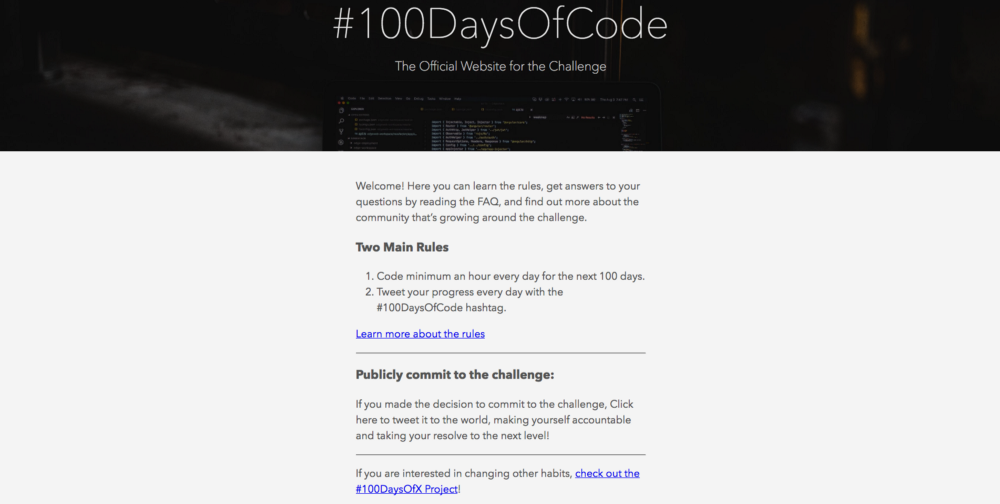
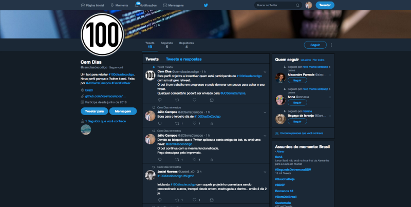

O comportamento na comunidade de desenvolvimento tem se tornado um pouco hostil.

Briga de egos e tentativas de se destacar sobre os outros acabaram gerando algumas polêmicas, 
o que motivou o surgimento de novos grupos no Telegram. Estes grupos trazem uma proposta um pouco 
diferente, servindo como um local inclusivo e não agressivo para desenvolvedoras(es).

Um desses grupos é a [#GuildaTech](https://t.me/guildatech).

A principio o grupo surgiu para diminuir os assuntos de programação no grupo [#NerdsOnBeer](https://t.me/nerdsonbeer), 
mas acabou se tornando um espaço virtual convidativo para todas as pessoas.

A #GuildaTech sempre foi pautado por ótimas discussões. Nem sempre falando sobre programação já foram 
discutidos política, podcasts, sistemas operacionais e desafios pessoais para aprender e se aprimorar.

Nesse ponto de se aprimorar sempre fica claro que é preciso estudar todos os dias e colocar em prática. 
A consistência de estar todos os dias com o editor aberto e digitando código ou lendo algum artigo ajudam 
a desenvolver uma disciplina que acaba se incorporando ao dia-a-dia. Tem quem faça Free Code Camp, 
tem quem faça dojos e tem quem tente programar fazendo o desafio #100DaysOfCode.

Todos esses caminhos são cansativos, frustrantes e difíceis quando seguidos sozinhos. 
É preciso um apoio, nem que seja um fórum de dúvidas, para conseguir se aprimorar todos os dias.

Aí que entra a #GuildaTech.

Por ser uma comunidade com pessoas incríveis com o mesmo objetivo, o grupo acabaria dando suporte 
nos dias de preguiça ou projetos em conjunto poderiam surgir.

O desafio foi aportuguesado para [#100diasdecodigo](https://twitter.com/search?f=tweets&vertical=default&q=%23100diasdecodigo&src=typd) 
para que fique mais fácil para nos achar no Twitter.

Algumas pessoas começaram no dia 02 de junho.

Eu também comecei nesse dia e como primeiro projeto eu desenvolvi um bot para Twitter que 
buscaria todos os tweets com a hashtag #100diasdecodigo e retweetaria.

O projeto foi desenvolvido em Node.js e pode seu código pode ser visto [AQUI](https://github.com/jcserracampos/100diasdecodigo_bot) 
e seu perfil no twitter pode ser seguido [AQUI](https://twitter.com/cemdiasdecodigo).

Farei mais textos no Medium sobre como anda o meu desafio, projetos novos, 
o que aprendi e, principalmente, as dificuldades em se comprometer com algo tão grande assim.

Se você também quiser participar é só se comprometer com o #100diasdecodigo.

Não há regras, não há fórmula. Criar uma regra, como uma hora por dia, é criar uma barreira. 
Vamos olhar o nosso dia e perceber que uma hora de programação é muito e acabar pulando 
aquele dia e aí foi-se embora a consistência.

Alguns se comprometem publicamente, outros se comprometem com um colega. Não importa.

O que recomendo é que entre no grupo #GuildaTech e tweet com #100diasdecodigo para 
que outras pessoas no mesmo desafio lhe achem.
