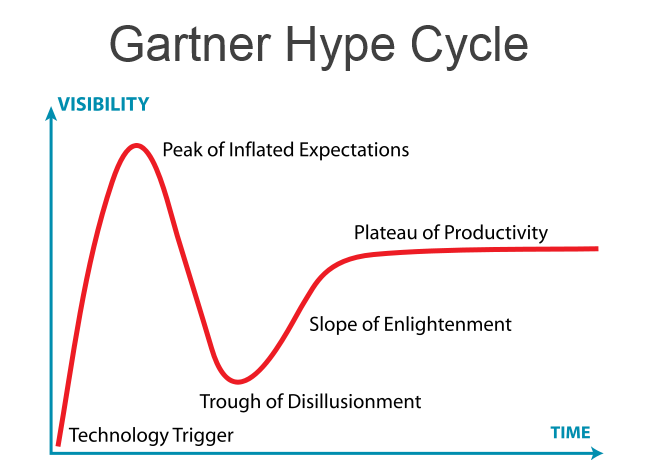

Roy Amara  formulou uma lei ao observar como as pessoas avaliavam novidades nos anos 1960. A chamada __Lei de Amara__ diz que “tendemos a sobrestimar o efeito de uma tecnologia no curto prazo e subestimá-lo no longo prazo”.

Se pararmos para analisar, essa lei pode ser aplicada para além dos produtos tecnológicos. Por exemplo, recentemente, para quem é do mundo de desenvolvimento, os bancos NoSQL seriam a solução para todas as aplicações, hoje em dia já não o vêem como essa bala de prata para aplicações web. Como também,  a energia fotovoltaica seria a solução para a matriz elétrica de qualquer país, porém hoje parece algo distante.

Com a __Blockchain__ o processo não está sendo muito diferente.

Seguindo a mesma linha do futurista Amara, a consultoria de tecnologia Gartner desenvolveu uma ferramenta chamada __hype cycle__  que define os estágios da vida de uma tecnologia de forma gráfica.

Veja o grafico:

Aqui vamos que, para a Gartner, existe um gatilho tecnológico em que uma nova tecnologia tende a ter suas expectativas infladas até atingir um pico, coincidindo com a fala de Amara  sobre sobrestimarmos o novo no curto prazo. Principalmente porque as pessoas que aderem à novidade acreditam, com convicção, em seu potencial, são os chamados _early adopters_.

É fácil lembrar como a Blockchain era retratada como salvadora há pouco tempo. Uma corrente de blocos era a melhor solução para dinheiro, saúde, transparência, blogs, sites de vídeo, venda de carros, bilhete de transporte público, passeio com cachorros, venda de sorvete na rua e milhares de outras aplicações.

Apesar  do Bitcoin , protocolo descrito por Satoshi Nakamoto, ser uma tecnologia que completou dez anos, ela somente foi popularizado pela grande valorização da criptomoeda que vimos acontecer nos últimos quatro anos. Este foi o pico da expectativa do Bitcoin, e então vivemos o suprassumo do _hype_.

Como moedas virtuais são apenas uma das aplicações para blockchain, logo começaram a surgir várias outras, transformando-a  na pedra filosofal do mercado de tecnologia  e parecia fazer muito sentido integrá-la em qualquer serviço, naquele momento.

Entretanto, as coisas não saíram como era o esperado. 

Diversos projetos foram abandonados, vários _tokens_ foram vendidos, empresas venderam participações através de oferta inicial de moedas, (ICOs) e a mídia começou a noticiar a desconfiança nas criptomoedas do  mercado financeiro.

 Nesta etapa chegamos ao vale da desilusão.

Ainda não o completamos, estamos caminhando para o fundo. Se  olharmos pelo prisma de Amara, este é o ponto em que as  pessoas começam a subestimar a blockchain.  O que torna comum noticias que dão conta  de que  a moeda não vale o custo de mineração, que é somente uma bolha ou que é uma tecnologia difícil de ser utilizada.

 Logo, a veremos  passando pelo aclive da iluminação, segundo Gartner, até chegar ao platô da produtividade e, assim, começar a ser utilizada em seu  potencial.

Obviamente que a tecnologia ainda não cumprirá todas as expectativas iniciais, mas superará as pessimistas que surgem nesta caminhada para o vale da desilusão.

O ponto é que blockchain, como todas as outras tecnologias sujeitas ao _hype cycle_ e a Lei de Amara, ainda mostrará bons frutos no futuro.