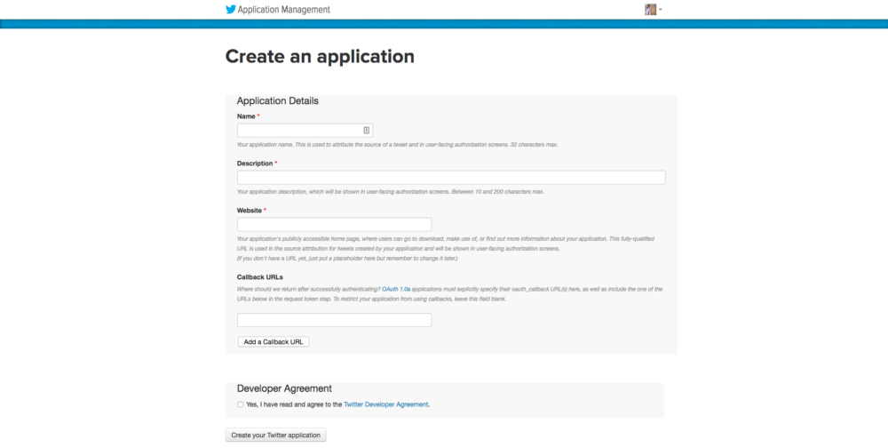
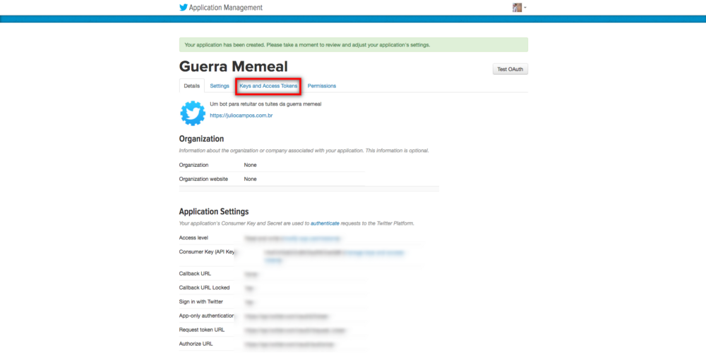
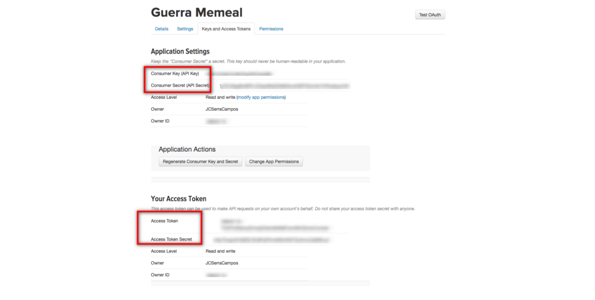

Depois da experiência de desenvolver o @cemdiasdecodigo resolvi compartilhar o processo, 
ainda mais depois que a thepurpleana perguntou no Telegram como fazer um também.

Neste tutorial, faremos um bot em Node.js para retweetar uma hashtag específica. 
Ou seja, será feita uma busca nos últimos tweets a cada x minutos e a aplicação retuitará em sua conta.

O bot foi desenvolvido com Node.js, mas mesmo que ECMAscript (JavaScript para os íntimos) não seja sua área, 
vale a pena seguir este tutorial se você tiver a necessidade de um bot simples.

---

## Pré-requisitos

Para tirar seu bot do 0 e colocá-lo no ar, você vai precisar:
* saber um pouco de JavaScript ou até mesmo outra linguagem de programação (não se preocupe com sintaxe agora); 
* um terminal (Para quem está no Windows 10, pode utilizar o [Windows Subsytem](https://www.felipefialho.com/blog/2017/usando-o-terminal-do-linux-no-windows)); 
* o [Node.js](https://nodejs.org/) e um gerenciador de pacotes de node instalados na sua máquina (NPM ou Yarn) — 
quando você instalou o Node.js, o NPM já deve ter sido instalado, 
mas não custa checar com o comando `npm version`; 
* uma conta do Twitter com número de celular verificado; 
* e uma conta no Heroku.

## Como acompanhar
Para acompanhar este tutorial você precisará de um editor de códigos 
(Code, Sublime, Emacs, Vim etc) ou uma IDE de JavaScript e conexão com a internet.

## Começando o projeto
Para criar um bot para Twitter é necessário que você crie uma nova aplicação na plataforma para obter suas credenciais de acesso e da aplicação.

Por medidas de segurança, o Twitter pede que você possua um número de celular verificado em sua conta — pode usar o mesmo da conta pessoal se for criar uma conta específica para o bot.

Com a conta possuindo um número verificado, visite <https://apps.twitter.com/> e clique em Create new app (Criar novo aplicativo).



Dê um nome para seu aplicativo, uma descrição e um site — pode ser repositório do Github, 
site pessoal ou até mesmo localhost — e aceite os termos de uso. Para este tutorial, não usaremos _callbacks_.

Depois de pensar no nome — talvez a parte mais difícil do projeto — você verá a seguinte tela:



O que importa aqui é a aba Keys and Access Tokens (grifado no print acima). 
Ao acessar, você já verá Consumer Key (API Key) e Consumer Secret (API Secret). 
Anote eles em um bloco de notas.

Agora gere um novo token de acesso para sua conta. Lembrando que estamos pensando em um bot que 
será executado somente em uma conta, para distribuir este bot, você precisa pensar em sistema de OAUTH e callback.

Depois de gerar um novo token de acesso, anote essas chaves porque vamos precisar delas daqui a pouco e — importante- compartilhar com ninguém esses valores.



Agora podemos partir para nossa aplicação em Node.js

Crie um novo projeto com seu gerenciador de pacotes favoritos. Atualmente eu utilizo npm depois de alguns problemas com yarn, mas isto é pauta para outro texto.

Execute no seu terminal:

```bash
npm init
```

ou

```bash
yarn init
```

Você pode dar enter em tudo e configurar depois ou já pode colocar algumas informações para publicar se pacote como nome, versão e licença de uso.

Depois de criado o seu projeto, adicione as dependências dotenv e twit. Você pode fazer via terminal executando

```bash
npm install dotenv twit 
```

Ou

```bash
yarn add dotenv twit
```

Ou configurando as dependências diretamente no seu package.json.

No final você terá um arquivo assim:

```json
{
 “name”: “guerramemeal”,
 “version”: “1.0.0”,
 “description”: “”,
 “main”: “index.js”,
 “scripts”: {
     “test”: “echo \”Error: no test specified\” && exit 1"
 },
 “author”: “”,
 “license”: “ISC”,
 “dependencies”: {
     “dotenv”: “6.0.0”,
     “twit”: “2.2.10”
 }
}
```

Para finalizar, só adicione um script para começar o projeto. Ele vai ajudar na hora de fazer o deploy da aplicação. Assim sua entrada scripts no package.json ficará assim:

```json
“scripts”: {
    “start”: “node index.js”,

    “test”: “echo \”Error: no test specified\” && exit 1"

}
```

## O bot em si

Com o projeto iniciado, podemos começar a parte do código.

Para gerenciar nossas chaves de aplicação do Twitter e não deixar elas expostas por aí, vamos usar o dotenv. Para isto, crie um arquivo .env na raiz da sua aplicação e configure com aquelas chaves geradas anteriormente. Vai ficar mais ou menos assim — lógico que suprimi as minhas chaves.

```
CONSUMER_KEY= 

CONSUMER_SECRET= 

ACCESS_TOKEN= 

ACCESS_TOKEN_SECRET= 
```

Agora crie um arquivo index.js em que colocaremos nossa lógica do bot.

Comece o arquivo importando nossas dependências.

```javascript
var Twit = require(‘twit’);

require(‘dotenv’).config();

Depois instancie um objeto twit com as chaves salvas no arquivo .env.

const Bot = new Twit({

consumer_key: process.env.CONSUMER_KEY,

consumer_secret: process.env.CONSUMER_SECRET,

access_token: process.env.ACCESS_TOKEN,

access_token_secret: process.env.ACCESS_TOKEN_SECRET,

timeout_ms: 60 * 1000,

});
```

Para o bot funcionar corretamente, ele precisa de uma função BotInit(). Para fins educacionais, farei toda a lógica do bot dentro desta função.

```javascript
function BotInit() {

    var query = {
//Aqui vai o que você quer buscar

        q: "#guerramemeal",

        result_type: “recent”

    }
// Este método busca os tweets mais recentes baseado na sua query

    Bot.get(‘search/tweets’, query, BotGotLatestTweet);

    function BotGotLatestTweet (error, data, response) {

        if (error) {

            console.log(‘Bot could not find latest tweet, : ‘ + error);

        } else {

            var id = {

            id : data.statuses[0].id_str

        }

// Neste método será retweetado o tweet localizado
        Bot.post(‘statuses/retweet/:id’, id, BotRetweeted);

        function BotRetweeted(error, response) {

            if (error) {

            console.log(‘Bot could not retweet, : ‘ + error);

        } else {

            console.log(‘Bot retweeted : ‘ + id.id);

        }

    }

}

}
```

Para fazer o bot viver, configure um timeout e chame a função BotInit()

```javascript
/* Define um timeout de 30 minutos (in microsecondes) */

setInterval(BotRetweet, 30*60*1000);

/* Inicia o Bot */

BotInit();
```

Este é o básico para você conseguir fazer o bot funcionar.

Você pode trabalhar com querys mais complexas usando AND, OR, NOT e outros operados lógicos.

No final, seus arquivos ficarão assim, depois de uma refatoração:

.env
```
CONSUMER_KEY= 
CONSUMER_SECRET= 
ACCESS_TOKEN= 
ACCESS_TOKEN_SECRET=
```

index.js
```javascript
var Twit = require('twit');

require('dotenv').config();

/* Instancie o bot com as chaves no arquivo .env */
const Bot = new Twit({
  consumer_key:         process.env.CONSUMER_KEY,
  consumer_secret:      process.env.CONSUMER_SECRET,
  access_token:         process.env.ACCESS_TOKEN,
  access_token_secret:  process.env.ACCESS_TOKEN_SECRET,
  timeout_ms:           60 * 1000,
});

console.log('Este bot está rodando...');

/* BotInit() : Para iniciar o bot */
function BotInit() {
	var query = {
		q: "#guerramemeal",
		result_type: "recent"
	}

	Bot.get('search/tweets', query, BotGotLatestTweet);

	function BotGotLatestTweet (error, data, response) {
		if (error) {
			console.log('Bot não pôde achar o último tweet, : ' + error);
		}
		else {
			var id = {
				id : data.statuses[0].id_str
			}

			Bot.post('statuses/retweet/:id', id, BotRetweeted);
			
			function BotRetweeted(error, response) {
				if (error) {
					console.log('Bot não pode retweetar, : ' + error);
				}
				else {
					console.log('Bot retweetou : ' + id.id);
				}
			}
		}
	}
}

/* Configure um intervalo de  30 minutos (em microsegundos) */
setInterval(BotRetweet, 30*60*1000);

/* Inicialize o bot Bot */
BotInit();
```

package.json
```json
{
 "name": "guerramemeal",
 "version": "1.0.0",
 "description": "",
 "main": "index.js",
 "scripts": {
     "test": "echo \"Error: no test specified\" && exit 1"
 },
 "author": "",
 "license": "ISC",
 "dependencies": {
     "dotenv": "6.0.0",
     "twit": "2.2.10"
 }
}
```

Um exemplo do completo pode ser visto no [repositório do cemdiasdecódigo](https://t.co/FbQordillV).

## Executando localmente

Para testar o seu bot localmente, basta executar o seguinte comando em seu terminal:

```
node index.js
```

Se tudo ocorrer bem, você deverá ver a mensagem Este bot está rodando…

O bot procurará o último tweet disponível na busca e tentará retweetá-lo. Tenha em mente que quando você for fazendo sucessivos testes poderá ocorrer um erro de não poder retweetar o mesmo tweet. Se isto acontecer, vá a sua conta do Twitter e desfaça o retweet.

---

## Colocando o bot em produção no Heroku

Para esta parte, você também precisará do Git e [heroku-cli](https://devcenter.heroku.com/articles/heroku-cli) instalados na sua máquina, ok? Existem outras maneiras de você colocar o seu código no Heroku, mas via git é a mais fácil na minha opinião.

Com o Heroku você consegue colocar seu bot no ar gratuitamente com algumas limitações. Estas limitações não chegam a interferir na qualidade ou no tempo online do nosso bot — lembra que configuramos para ele rodar a cada 30 minutos?

Primeiramente, crie um arquivo chamado Procfile na pasta raiz de sua aplicação. Nele coloque o seguinte código e salve:

```json
worker: node index.js
```

Agora o Heroku saberá que você utilizará o worker (processo) e não um sistema web.

Para facilitar, eu recomendo você [olhar este artigo em português sobre heroku toolbet a partir do 3, 2, 1… Deploy \o/](http://jtemporal.com/deploy-flask-heroku/). O que muda do nosso tutorial para esse artigo já foi coberto aqui em cima.

---

Acabei editando este artigo para cobrir uma parte introdutória sobre os requisitos e adicionando a parte de deploy no Heroku depois de um toque da Ana Roxa.

Estou aberto a mais sugestões para continuar melhorando este tutorial.

---

Espero ter ajudado a todos e vocês podem falar comigo no [Twitter](https://twitter.com/JCSerraCampos) e no grupo do telegram [#GuildaTech](htts://t.me/GuildaTech)
