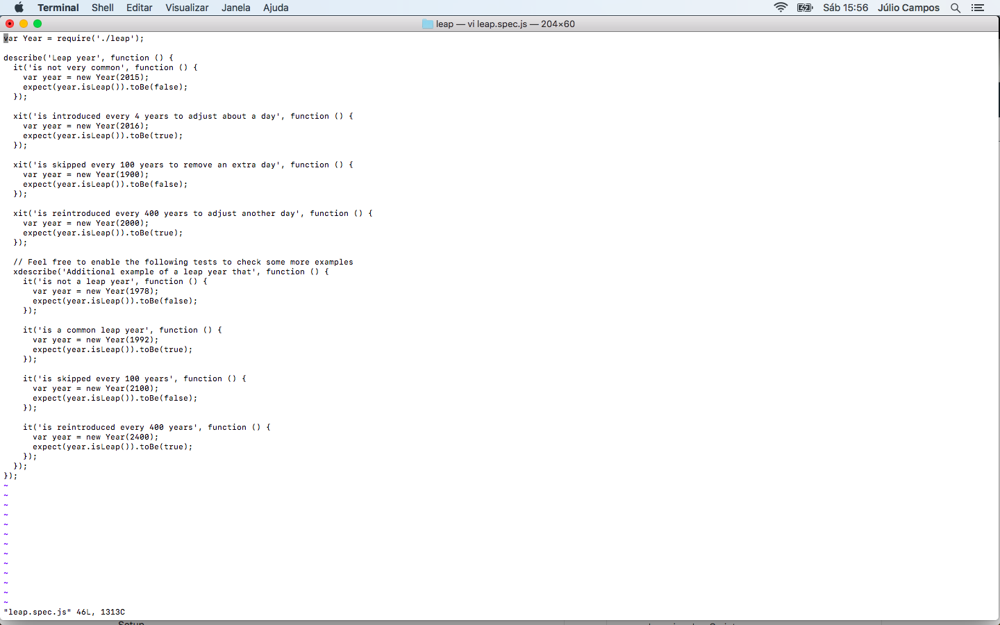
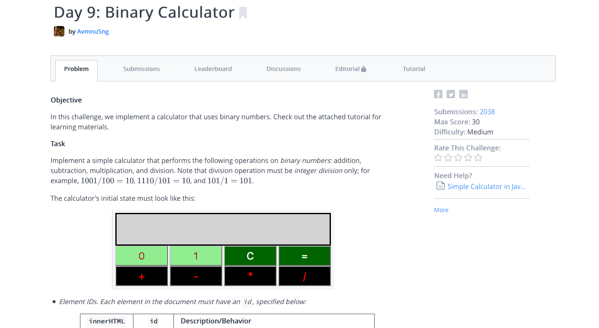
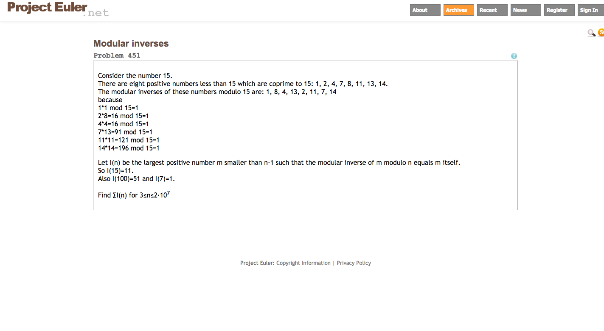

Mantendo o perfil dos cem dias de código no Twitter, é comum eu ver pessoas sem ideias para o que fazer ao passar do desafio.

Eu não sou a pessoa mais criativa do mundo para criar desafios e no meu desafio estou seguindo aprendendo duas linguagens novas, o que me mantém bem ocupado fazendo sistemas simples e arrumando meus erros.

---

## Exercism

[Exercism](http://exercism.io/) é uma plataforma gratuita de prática de programação e para receber mentoria.

Basicamente você instalar uma aplicação de linha de comando na sua máquina, faz login com sua conta criada no site e baixa desafios de programação.

Na sua máquina, com seu ambiente de desenvolvimento, você programa e depois sobe seu código para a plataforma. Lá você tem a opção de pedir a revisão de um mentor que vai comentar a sua resolução e pode propor algumas melhorias ou ensinar coisas novas. Também há a opção de não receber a revisão e apenas validar a resposta.

Exercism possui 48 linguagens de programação com 18 a 119 exercícios para serem praticados. Infelizmente só está em inglês.

[A Rachel Curioso já propôs a tradução do conteúdo para português](https://github.com/exercism/exercism/issues/4207) através de voluntários e estamos aguardando a plataforma dar uma resposta.

## HackerRank

[HackerRank](https://www.hackerrank.com/) se apresenta como uma plataforma de recrutamento técnico e, acredite, muitos recrutadores vão a utilizar para verificar seu nível de habilidade em programação.

São 6 linguagens para praticar de forma online, bem como conceitos básicos como algoritmos, estrutura de dados, matemática e programação funcional. Também existem exercícios para conceitos mais avançados como inteligência artificial e sistemas distribuídos.

Cada exercício possui materiais complementares, discussão sobre respostas e um tutorial, mas não se engane, mesmo com tudo isso, você terá que suar para resolver alguns exercícios.

Você também pode entrar em competições online promovidas pela própria plataforma e outras empresas. Algumas oferecem recompensas para as pessoas melhores qualificadas.

Atualmente, HackerRank é uma plataforma somente em inglês.

## CodeWars

Na [CodeWars](https://www.codewars.com/) você convoca sua ninja interior e se desafia a concluir katas de programação. Estes são desafios online que já possuem testes disponíveis, forçando a ninja em treinamento a usar TDD e o mais interessante é que os desafios são criados por pessoas da comunidade, assim você pode criar um kata e disponibilizar para outras pessoas tentarem.

São 20 linguagens de programação disponíveis para treinar incluindo até algumas menos utilizadas como F# ou Crystal.

Seu principal diferencial é o sistema de pontuação que bebe das artes marciais e lhe dá a possibilidade de ser tornar uma pessoa mestre em programação, ou ao menos dizer que é primeiro kyu no CW.

Também é possível comparar suas resoluções com outras pessoas e discutir sobre as melhores práticas.

CodeWars também só está disponível em inglês.

## Project Euler

Project Euler pode aparentar ser o projeto mais simples e sem o glamour dos magos de UI, mas é a plataforma mais agnóstica de todas e isso é bom!

São 624 desafios com o foco em matemática que vão lhe desafiar a pensar, procurar um material de Cálculo I e chorar um pouco, mas com toda certeza farão de você uma pessoa mais inteligente e preparada como programadora e, de quebra, ainda aprende Cálculo Numérico.

As respostas são números e se você quiser, poderá criar uma conta na plataforma e submeter a sua resposta final para saber se acertou ou não.

Project Euler está totalmente em inglês e matematiquês, mas é possível achar uma versão traduzida com menos problemas.

---

E aí? Já tem desafios suficientes para os dias sem criatividade?

Faltou alguma plataforma?

Comente e compartilhe com seus amigos para que todos possam chorar um pouco juntos no twitter usando a tag #100DiasDeCodigo.

