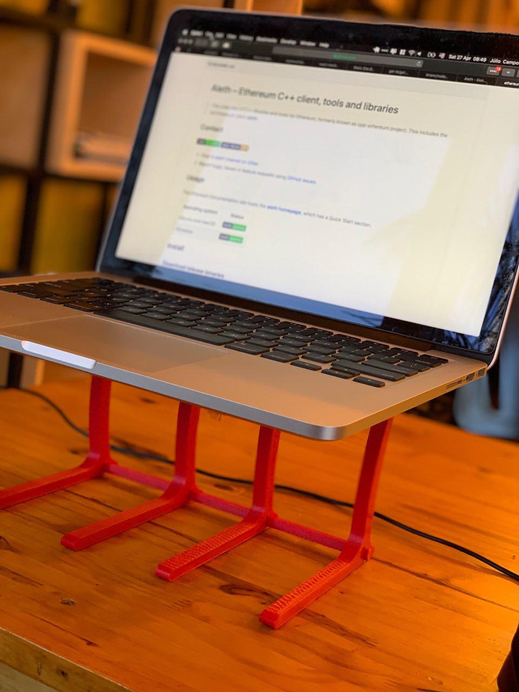

# Um pequeno guia #Officeless
Não é de hoje que eu acredito que ter uma baia para chamar de minha seja algo necessário para ter uma alta produtividade. Na verdade, eu tenho percebido que não estar em um escritório tem melhorado a minha produtividade.

Seja pela mudança de ares, seja pelas conversas com pessoas diferentes e fora da minha área durante os intervalos ou até mesmo porque eu me sinto na obrigação de trabalhar já que sai para isso.

Não sou o percursor do termo #Officeless, mas nada me impede de ser um grande apreciador dele, não é mesmo?	

Confesso que até hoje eu me pego tendo dificuldades alguns dias de trabalhar fora de casa ou do escritório, mas resolvi escrever alguns dicas para quem está querendo produzir numa cafeteria ou shopping.

Se tiver mais alguma dica para adicionar aqui ou quiser conversar sobre, [pode me procurar no Twitter](https://twitter.com/JCSerraCampos) que ficarei feliz em interagir.

## Não esqueça seus carregadores
Talvez pareça um pouco óbvio, mas recentemente eu cheguei a cafeteria e percebi que não tinha levado o carregador do meu laptop. Resultado: meu trabalho foi uma corrida contra o tempo.

Mesmo que seu computador tenha uma bateria infinita, não custa levar o carregador dele com você.

Outro aparelho que não pode descarregar enquanto você trabalha no seu escritório que não é escritório é o celular. Chamadas, mensagens e até sua ida embora dependem dele. Com o carregador do seu laptop na mala, basta o cabo do celular para carregá-lo (a menos que você tenha um MacBook novo e portas USB não sejam seu forte).

## Tenha uma mochila preferida
Por mais que digam que basta sair para trabalhar e tudo estará funcionando, não é bem assim que funciona.

Ter uma mochila preferida, aquela que sempre lhe acompanha, é mais um truque do que dica. Sabe aquela rotina de celular, chave e óculos antes de sair? Você pode ter a mesma coisa com a sua mochila. Laptop, carregador, mouse, garrafa de água e remédios? Se tudo estiver lá, você estará preparada(o).

Com o tempo, você vai sentir mais necessidade de carregar mais coisas com você, então pense em investir em uma mochila mais resistente e com apoio na lombar (vai que a viagem de ônibus demora mais do que o esperado e você precise ficar em pé).

E que tal [uma mochila impermeável e anti-furto para lhe acompanhar?](https://amzn.to/2W5FwYE)

Anedota: um dia sai para trabalhar com uma pasta mais baratinha, a alça rasgou, caiu no chão e a tela do meu laptop estragou. Daria para comprar 6 mochilas boas com o preço que me cobraram.

## Beba água
Não importa a temperatura ou o lugar, sempre se hidrate. Uma pessoa hidratada é uma pessoa produtiva.

Em alguns municípios é lei que o estabelecimento lhe forneça água filtrada de graça. Claro que não vale um embate judicial porque a cafeteria lhe negou um copo de água, mas fica o aviso para evitarem voltar em lugares assim.

Pessoalmente, sempre ando com uma garrafa de água e tento mante-la sempre cheia.

## Conheça suas opções
Por mais que pareça legal trabalhar naquela cafeteria descolada em que todo mundo tira fotos, nem sempre sai barato.

Quando você precisa passar horas em um lugar que vende comida, vai lhe dar fome e um comichão para comer aquele brownie que acabou de sair do forno. Então procure conhece os cardápios dos lugares que você frequenta ou pretende frequentar.

Pagar R$ 8,00 em um espresso pode parecer ok, mas se você tomar 4 desses e mais uma torrada sua conta já ficará maior que um belo prato de salada do Bapi.

Também é importante ter mais de uma opção sempre a mente. Imprevistos ocorrem e o lugar escolhido pode estar lotado ou até mesmo fechado - ou pior… sem internet.

## Por falar em internet…
Sua internet móvel pode ser sua principal aliada quando estiver na rua. Apesar de parecer doloroso pensar em usar a internet do seu celular para subir um código ou criar um anúncio no Facebook, nem sempre você consumirá 2 GB para entrar no facebook.

O Windows 10 e o macOS possuem modos que reduzem as atualizações em segundo plano para poupar dados quando você estiver utilizando uma rede 3G/4G/5G.

Também tenho por hábito fazer um teste de velocidade na internet do lugar que estou trabalhando, assim se perceber uma lentidão, faço um teste e decido se mudo para a internet móvel.

Para quem trabalha com equipes remotas, é de suma importância estar com uma internet que permita fazer ligações de vídeo. Tenha por hábito testar isso.

Dica esperta: Evite usar seu e-mail real em cadastros para wifi. Se você usa gmail, pode usar algo como seuemailreal+nomedoshopping@gmail.com para saber se venderam seus dados.

## Tenha uma playlist #Officeless
Você sabe que cafeterias e shoppings são barulhentos, né?

Tendo uma playlist que lhe mantenha no ritmo de trabalho e evite ficar ouvindo os barulhos externos vai lhe blindar de querer saber o final da história pessoal da pessoa na mesa ao lado, além de servir como um bloqueador de conversas.

## Preocupe-se com a sua postura
Se você continuar trabalhando naquela mesa baixa da cafeteria, garanto que em um ano vai estar precisando de fisioterapia e suas sessões de trabalho só irão se encurtar com o passar dos dias.

Algo que adicionei recentemente a minha mochila preferida é um suporte de computador desmontável. Foi impresso por um amigo numa impressora 3D, mas garanto que você consegue achar algo parecido pela internet ou numa loja de informática aí perto. Se quiser uma dica, [recomendo fortemente esta ajustável que foi meu companheiro de guerra por muito tempo.](https://amzn.to/2GH50Vs)

## Pense fora da caixa
Não existem somente cafeterias e praças de alimentação de shoppings para se trabalhar. Talvez uma livraria seja uma boa opção, ainda mais se permitirem pesquisa em livros.

Sabe outro bom lugar para se trabalhar? Bibliotecas públicas! Silenciosas, com internet, livros para consultar, infraestrutura e a pessoa que fica na recepção sempre vai ter uma história ou outra para contar.

Por ora, acho que são essas dicas que tenho para passar para quem deseja estar #Officeless algum dia.